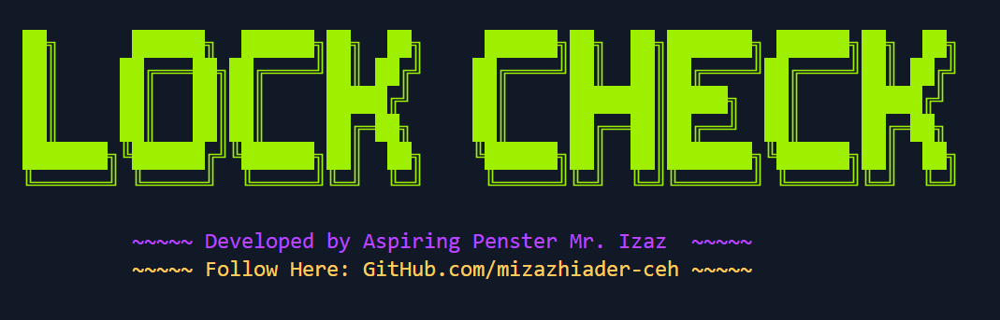
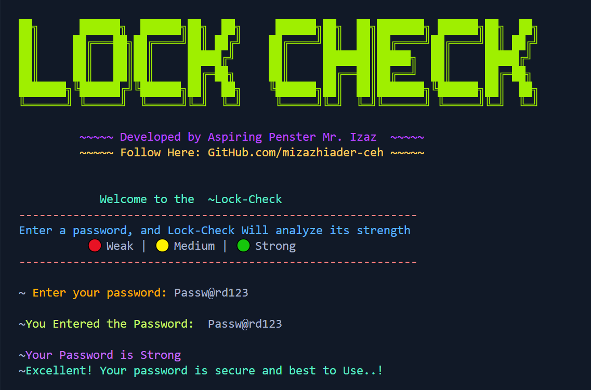
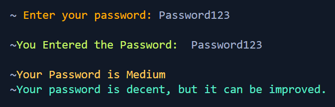
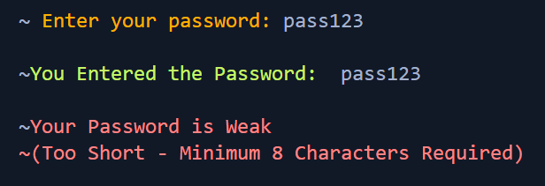

# Lock-Check - Password Strength Analyzer 🔐

**Developed by:** Muhammad Izaz Haider

**Internship Project at:** Prodigy InfoTech


## 📌 Overview

Lock-Check is a robust and interactive password strength analyzer built with Python. It evaluates password security based on various criteria, providing users with instant feedback on how strong their password is. The tool is designed to be user-friendly with a colorful command-line interface.

## 🛠 How Lock-Check Works

Lock-Check assesses password complexity based on the following factors:

* **Length** (Minimum 8 characters required)
* **Uppercase Letters** (At least one uppercase character)
* **Lowercase Letters** (At least one lowercase character)
* **Numbers** (At least one digit)
* **Special Characters** (At least one special character from `string.punctuation`)

Each factor contributes to the overall password strength:

* **🔴 Weak:** Password is too simple or too short.
* **🟡 Medium:** Decent but can be improved.
* **🟢 Strong:** Secure and recommended for use.

## 📌 Features

✔️ Analyzes password strength based on five key factors

✔️ Provides instant feedback with color-coded messages

✔️ User-friendly command-line interface

✔️ Works on Windows, Linux, and macOS

✔️ Error handling for invalid inputs

## 📂 Project Structure

```
PRODIGY_CS_02-Lock_Check/
│── lock_check.py            # Main Python script
│── README.md                # Project documentation
│── screenshots/             # Folder containing example outputs
│   │── logo.png             # Project logo
│   │── strong_pass.png      # Example of a strong password
│   │── medium_pass.png      # Example of a medium password
│   │── weak_pass.png        # Example of a weak password
```

## 🖥 Screenshots

### 🔐 Strong Password Example:



### ⚠️ Medium Password Example:



### ❌ Weak Password Example:



## 🎯 Why I Built This Project

This project was developed during my internship at **Prodigy InfoTech** to apply cybersecurity concepts in Python. It helped me understand password security mechanisms and develop an interactive CLI-based tool.

## 📚 What I Learned

✔️ Password security principles

✔️ Python string manipulation and built-in functions

✔️ Implementing security logic for password strength analysis

✔️ Enhancing CLI applications with color-coded outputs

✔️ Error handling and input validation

## 🛠 Installation & Usage

### 🔹 Prerequisites

Ensure you have **Python 3.x** installed on your system.

### 🔹 Clone the Repository

```bash
git clone https://github.com/mizazhaider-ceh/PRODIGY_CS_02-Lock_Check.git
cd PRODIGY_CS_02-Lock_Check
```

### 🔹 Run the Program

#### ✅ On Windows:

```bash
python lock_check.py
# or
python3 lock_check.py
```

#### ✅ On Linux or macOS:

First, grant execution permissions:

```bash
chmod +x lock_check.py
```

Then execute the script:

```bash
./lock_check.py
# or
python3 lock_check.py
```

### 🔹 Usage

1️⃣ Enter a password when prompted.

2️⃣ Lock-Check will analyze its strength.

3️⃣ Receive immediate feedback on whether it's  **Weak** ,  **Medium** , or  **Strong** .

## 🌟 Special Thanks

A huge thanks to **Prodigy InfoTech** for providing an incredible internship opportunity, allowing me to explore cybersecurity and refine my Python skills.

## 🏆 The Project Ends... But The Journey Begins!

If you like this project, consider giving it a ⭐ on  **[GitHub](https://github.com/mizazhaider-ceh/PRODIGY_CS_02-Lock_Check)** !

## 📜 License

This project is open-source and available under the  **MIT LICENSE** .

## 📬 Connect with Me

* **GitHub:** [mizazhaider-ceh](https://github.com/mizazhaider-ceh)
* **LinkedIn:** [Muhammad Izaz Haider](https://www.linkedin.com/in/muhammad-izaz-haider-091639314/)
* **Email:** [mizazhaider@gmail.com](mailto:mizazhaider@gmail.com)
